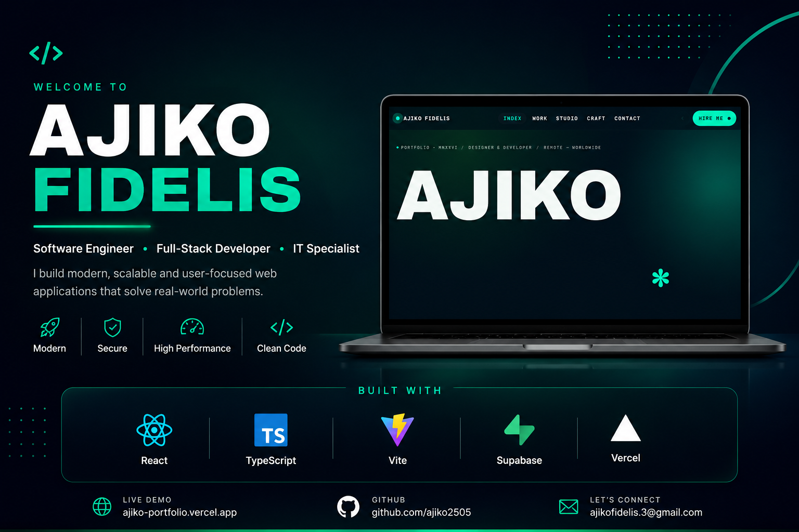
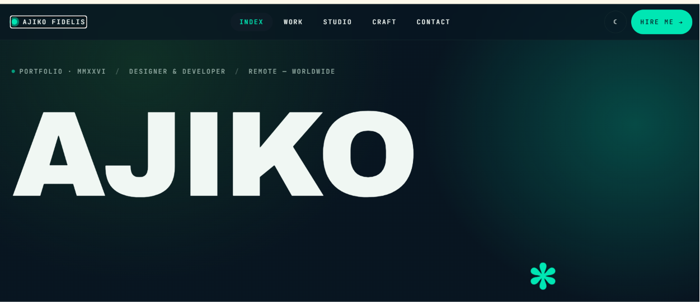
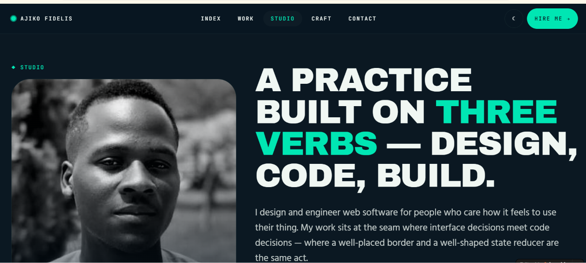
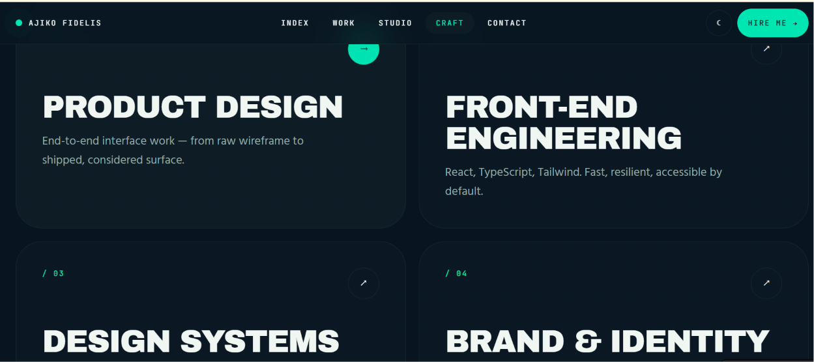
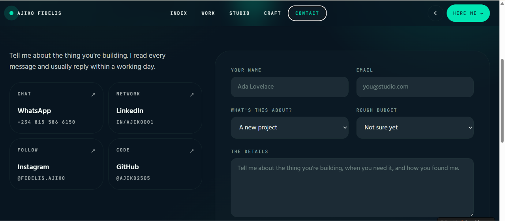
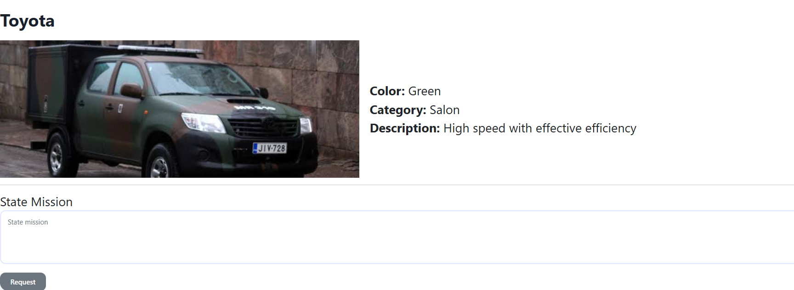
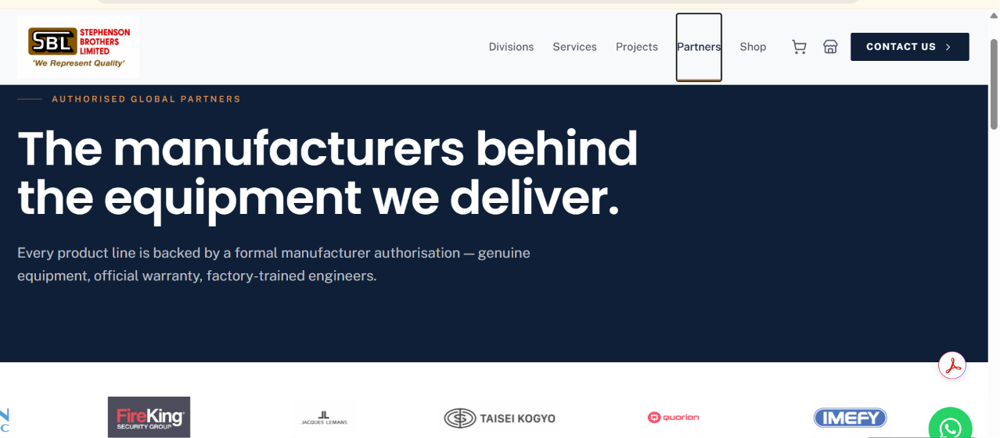
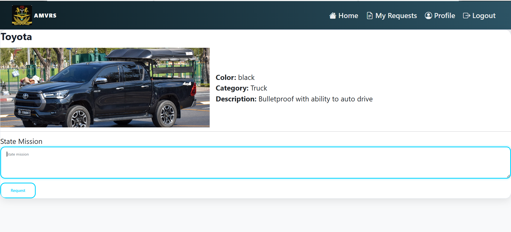
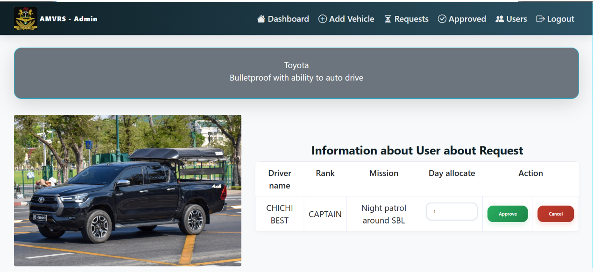
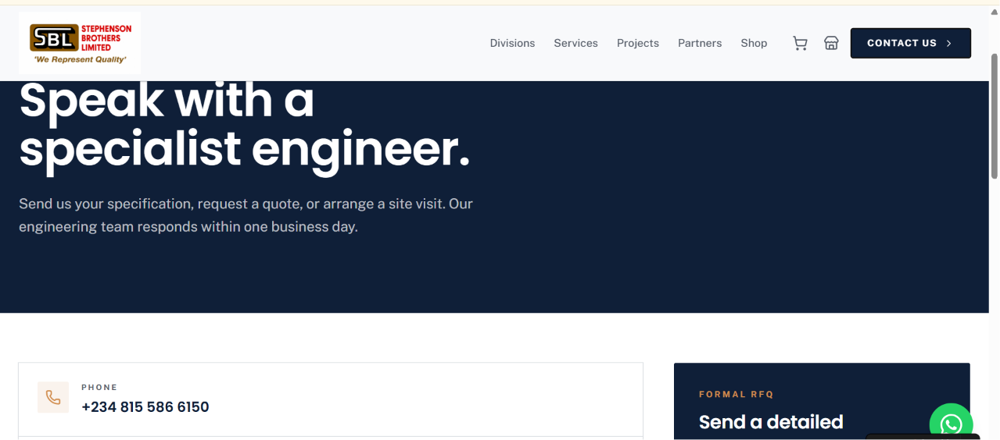

<p align="center">
  
</p>

<h1 align="center">🚀 Ajiko Portfolio</h1>

<p align="center">
A modern, responsive developer portfolio showcasing my projects, technical expertise, and professional journey as a <strong>Software Engineer</strong>, <strong>Full-Stack Developer</strong>, and <strong>IT Specialist</strong>.
</p>

<p align="center">

<a href="https://ajiko-portfolio.vercel.app">

</a>

<a href="https://github.com/ajiko2505">

</a>

<a href="https://www.linkedin.com/in/ajiko001">

</a>

<a href="mailto:ajikofidelis.3@gmail.com">

</a>

</p>

---

# 📖 Overview

Ajiko Portfolio is a modern developer portfolio built to showcase my technical expertise, featured projects, software engineering experience, and professional journey.

The application emphasizes performance, scalability, accessibility, responsiveness, and a clean user experience while serving as a central hub for recruiters, clients, and collaborators.

---

# ✨ Features

- ⚡ Lightning-fast performance
- 📱 Fully responsive design
- 🎨 Modern UI/UX
- 🌙 Dark mode experience
- 💼 Professional project showcase
- 🛠 Interactive technology stack
- 📩 Functional contact section
- 🚀 Optimized for deployment
- 🔍 SEO-friendly architecture
- 📊 Clean component structure
- ⚙ Modern development workflow
- ☁ Cloud-ready deployment

---

# 🖼 Project Showcase

## 🏠 Home

<p align="center">

</p>

---

## 👨‍💻 Studio

<p align="center">

</p>

---

## 🎨 Craft

<p align="center">

</p>

---

## 📞 Contact

<p align="center">

</p>

---

# 🚀 Additional Screens

<table>
<tr>
<td width="50%">

</td>
<td width="50%">

</td>
</tr>

<tr>
<td width="50%">

</td>
<td width="50%">

</td>
</tr>

<tr>
<td width="50%">

</td>
<td width="50%">

</td>
</tr>

</table>

---

# 🛠 Tech Stack

## Frontend

- React
- TypeScript
- Vite
- HTML5
- CSS3
- Tailwind CSS

---

## Backend & Services

- Supabase

---

## Development Tools

- Git
- GitHub
- VS Code
- Lovable
- Vercel

---

# 📂 Project Structure

```text
Ajiko-Portfolio/
│
├── public/
├── src/
├── supabase/
├── .github/
├── package.json
├── vite.config.ts
├── tsconfig.json
└── README.md
```

---

# ⚙ Installation

Clone the repository

```bash
git clone https://github.com/ajiko2505/Ajiko-Portfolio.git
```

Move into the project

```bash
cd Ajiko-Portfolio
```

Install dependencies

```bash
npm install
```

Run locally

```bash
npm run dev
```

Create production build

```bash
npm run build
```

Preview production build

```bash
npm run preview
```

---

# 🌐 Live Website

### 🔗 Portfolio

https://ajiko-portfolio.vercel.app

---

# 🎯 Why I Built This

This portfolio was created to provide a professional platform where recruiters, employers, and collaborators can explore my work, learn about my technical expertise, and discover the projects I've built.

The focus is on clean design, scalability, performance, and creating a memorable first impression.

---

# 📈 Future Improvements

- Blog integration
- CMS support
- Internationalization (i18n)
- Project filtering
- Analytics dashboard
- Case studies
- More project showcases
- Performance optimization
- Accessibility improvements
- Progressive Web App (PWA)

---

# 🤝 Contributing

Contributions, suggestions, and feedback are always welcome.

If you'd like to improve this project:

1. Fork the repository
2. Create a new branch

```bash
git checkout -b feature/new-feature
```

3. Commit your changes

```bash
git commit -m "Add new feature"
```

4. Push your branch

```bash
git push origin feature/new-feature
```

5. Open a Pull Request

---

# 📄 License

This project is licensed under the MIT License.

---

# 👨‍💻 Author

## Ajiko Fidelis

Software Engineer • Full-Stack Developer • IT Specialist

🌐 Portfolio

https://ajiko-portfolio.vercel.app

💼 LinkedIn

https://linkedin.com/in/ajiko001

📧 Email

ajikofidelis.3@gmail.com

🐙 GitHub

https://github.com/ajiko2505

---

# ⭐ Support

If you found this project helpful or inspiring, consider giving it a ⭐ on GitHub.

It helps others discover the project and supports my work.

---

<p align="center">

### Thanks for visiting! 👋

Building secure, scalable, and impactful software—one project at a time.

Made with ❤️ using React, TypeScript, Vite, Supabase & Vercel.

</p>
